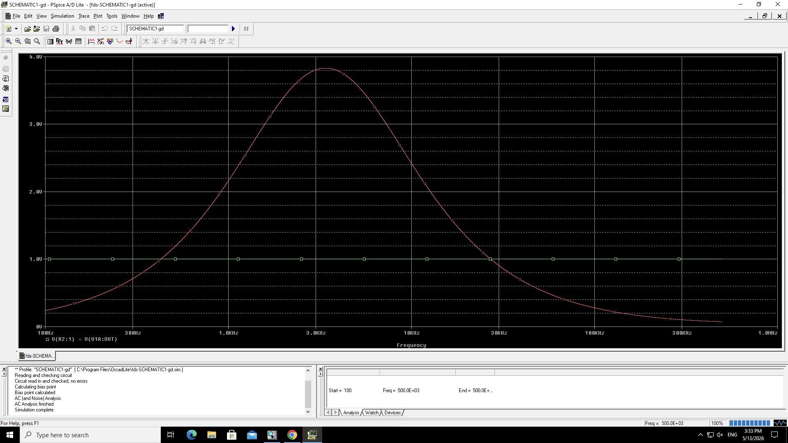
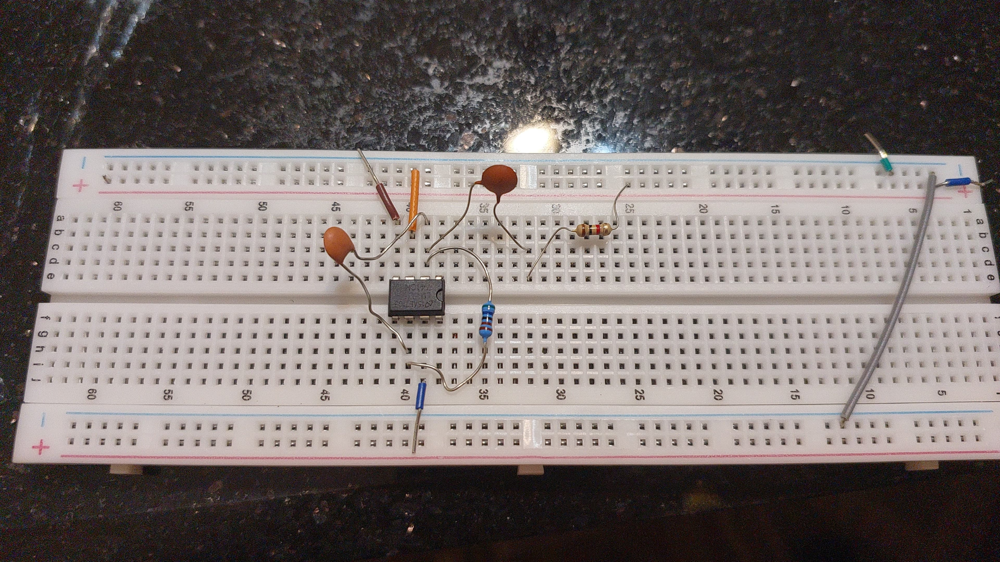
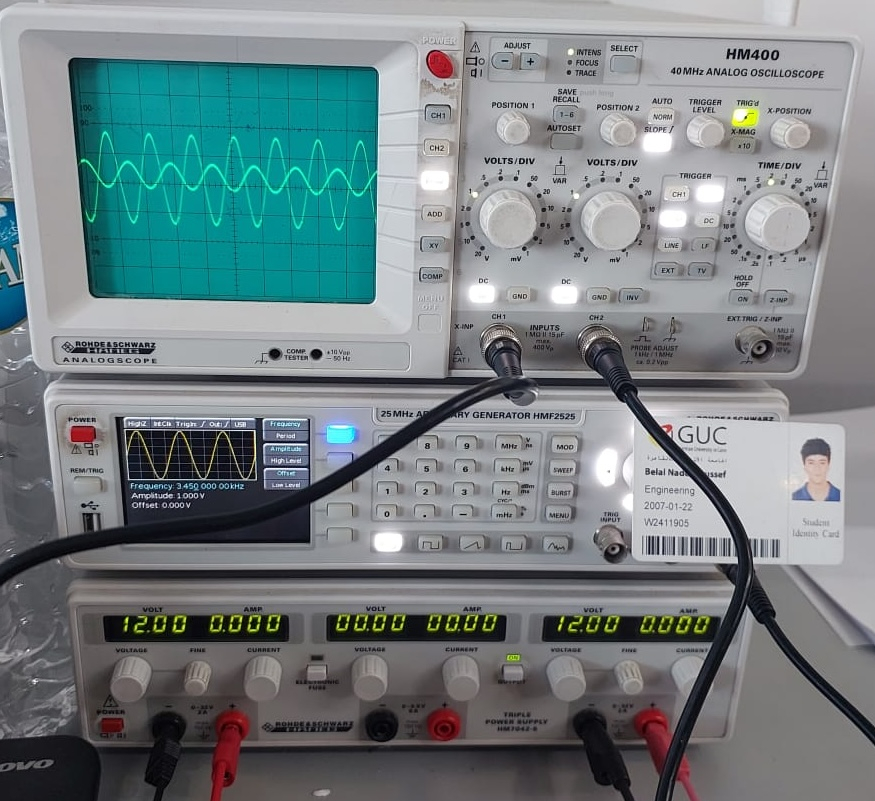

# Active Inverting Band-Pass Filter Design & Analysis

This repository contains the design, simulation, and hardware validation of an **Inverting Active Band-Pass Filter** using an LM741 operational amplifier.

## 🎓 Project Context

This project was developed by Computer Science and Engineering undergraduate students for the **ELCT 401: Electric Circuits II** course at the **German University in Cairo (GUC)**. 

The project demonstrates the full engineering lifecycle: from theoretical design to PSpice simulation, and finally, hardware implementation and oscilloscope verification. The exact center frequency ($f_0$) was determined by analytically differentiating the circuit's transfer function to find the absolute maximum gain.

---

## 📐 Transfer Function (Gain)

The circuit's behavior is governed by its voltage gain transfer function, derived via nodal analysis in the phasor domain:

$$H(j\omega) = \frac{-j\omega R_2C_1}{(1 - \omega^2 R_1C_1 R_2C_2) + j\omega(R_1C_1 + R_2C_2)}$$

By maximizing the magnitude of this function, the maximum theoretical voltage gain at the center frequency simplifies to:

$$|H_{\max}| = \frac{R_2C_1}{R_1C_1 + R_2C_2}$$

---

## ⚙️ Circuit Specifications

Based on the derived equations, the following components were selected to operate in the kilohertz range:
* **$R_1$ (Input):** $1 \text{ k}\Omega$
* **$C_1$ (Input):** $68 \text{ nF}$
* **$R_2$ (Feedback):** $5.6 \text{ k}\Omega$
* **$C_2$ (Feedback):** $5.6 \text{ nF}$

### Calculated Parameters vs. Results
| Parameter | Theoretical Value | Simulation / Hardware Results |
| :--- | :--- | :--- |
| **Lower Cut-off ($f_L$)** | 2.34 kHz | Verified via AC Sweep |
| **Upper Cut-off ($f_H$)** | 5.08 kHz | Verified via AC Sweep |
| **Center Frequency ($f_0$)** | 3.45 kHz | Verified via AC Sweep |
| **Maximum Gain ($H_{max}$)**| 3.83 | Verified via AC Sweep & Oscilloscope |

---

## 💻 Simulation & Validation

### PSpice Simulation
The circuit was designed and tested in PSpice before physical implementation.

* **AC Sweep:** Verified the frequency response, showing clear band-pass behavior with peak gain at ~3.45 kHz and correct rolloff.
* **Transient Analysis:** Time-domain simulations were run at $1 \text{ kHz}$ (attenuated), $3.45 \text{ kHz}$ (amplified), and $100 \text{ kHz}$ (heavily attenuated) to observe the precise input/output waveforms.

### Hardware Implementation
The circuit was built on a breadboard using an **LM741** op-amp. 

Testing with a function generator and digital oscilloscope confirmed:
1.  Attenuation at low frequencies ($1 \text{ kHz}$).
2.  Maximum gain and $180^\circ$ phase inversion at the calculated center frequency ($3.45 \text{ kHz}$).
3.  Heavy attenuation at high frequencies ($10 \text{ kHz}$).

---

## 📁 Repository Structure

* `docs/`: Contains the full project report (compiled PDF) and the LaTeX source code.
* `simulation/`: Contains the PSpice `.edf` file.
* `images/`: Contains circuit schematics, PSpice plots, and oscilloscope captures used in the report.

## 👥 Authors
* **Belal Nader Youssef**
* **Youssef Sameh Emil Shafik**